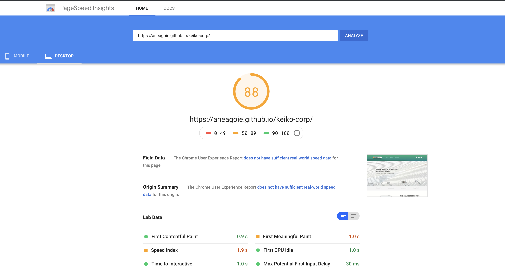
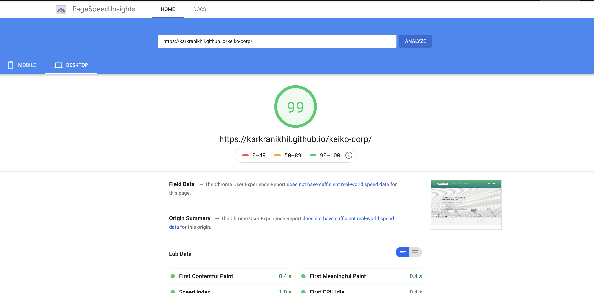

# keiko-corp
Demo website to understand more about the website performance issues and fixes

Steps taken to optimized this website are mentioned below
* a) moved js before closing body tag 
* b) changed image size for all screen sizes
* c) compressed/reduced images
* d) minified css
* e) minified all scripts
* f) Eliminated useless libraries
* g) replaced unnecessary JS/CSS + minified 

## PageSpeed Insights Before Optimization

## PageSpeed Insights After Optimization

